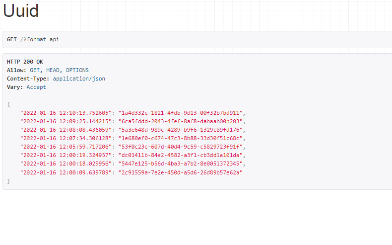

# random_uuid_generator
### cowrywise task:
Build a simple API that will return a key-value pair of randomly generated UUID. Key will be a timestamp and value will be UUID. While the server is running, 
whenever the API is called, it should return all the previous UUIDs ever generated by the API alongside a new UUID.

## Repo Structure:
1) uuid_gen: This is the django project.
2) uuidGen: This is the django app.

